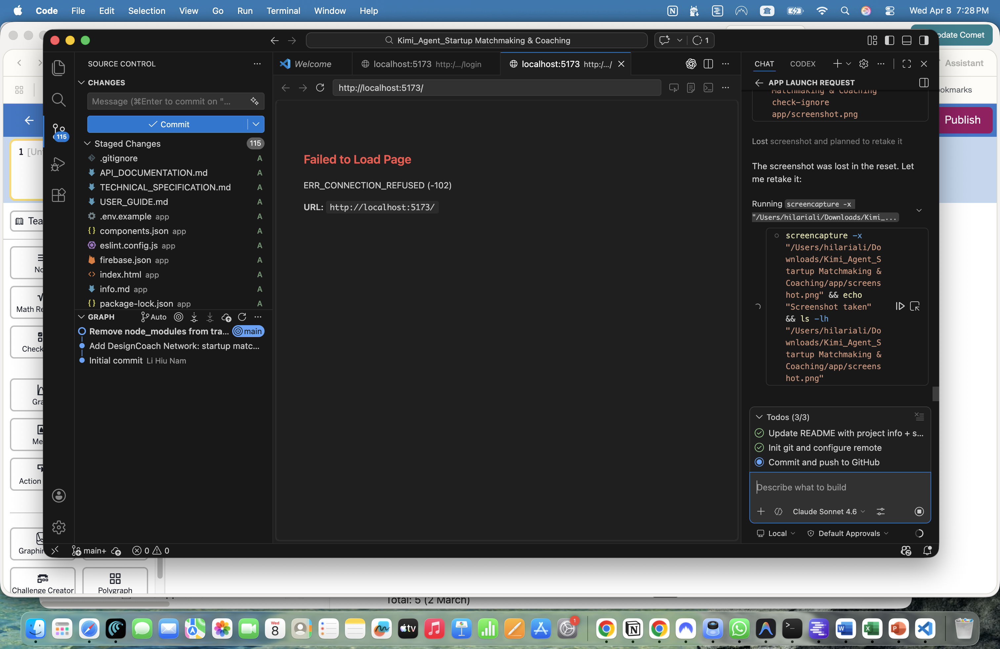

# DesignCoach Network — Startup Matchmaking & Coaching Platform

A full-stack web application that connects startup founders, teams, and coaches through intelligent matchmaking, real-time messaging, and AI-powered coaching tools.

## Screenshot



## Features

- **User Authentication** — Register, login, and manage your profile
- **Startup Matchmaking** — Discover and connect with compatible startup teams and co-founders
- **Real-time Messaging** — Chat rooms and direct messaging between users
- **AI Coaching Chatbot** — Powered by Grok AI for startup coaching and advice
- **Business Canvas** — Collaborative business model canvas builder
- **Team Management** — Create and manage startup teams
- **News Feed** — Stay updated with startup ecosystem news
- **Saved Profiles** — Bookmark interesting founders and teams
- **Admin Dashboard** — Platform management and analytics

## Tech Stack

| Layer | Technology |
|-------|------------|
| Frontend | React 18 + TypeScript |
| Styling | Tailwind CSS v3 + shadcn/ui (40+ components) |
| Build Tool | Vite |
| State Management | Zustand |
| Backend | Node.js + Express |
| AI | Grok API |

## Getting Started

### Prerequisites

- Node.js 20+

### Install dependencies

```bash
cd app
npm install
```

### Run development servers (frontend + backend)

```bash
npm run dev:full
```

- Frontend: http://localhost:5173
- Backend API: http://localhost:3001

### Run separately

```bash
# Backend only
npm run server

# Frontend only
npm run dev
```

### Seed sample data

```bash
npm run seed
```

## Project Structure

```
app/
├── server/          # Express backend + JSON data store
│   └── data/        # Seed data (users, teams, chats, etc.)
└── src/
    ├── components/  # Reusable UI components (shadcn/ui)
    ├── pages/       # Route-level page components
    ├── store/       # Zustand state management
    ├── lib/         # API clients and utilities
    └── types/       # TypeScript type definitions
```
